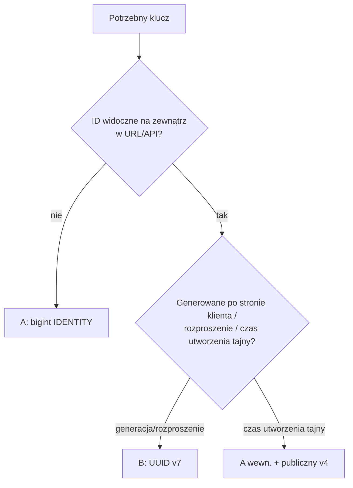
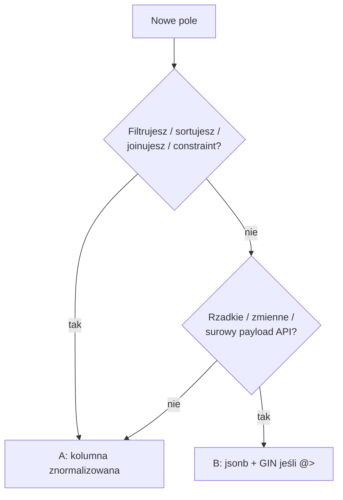
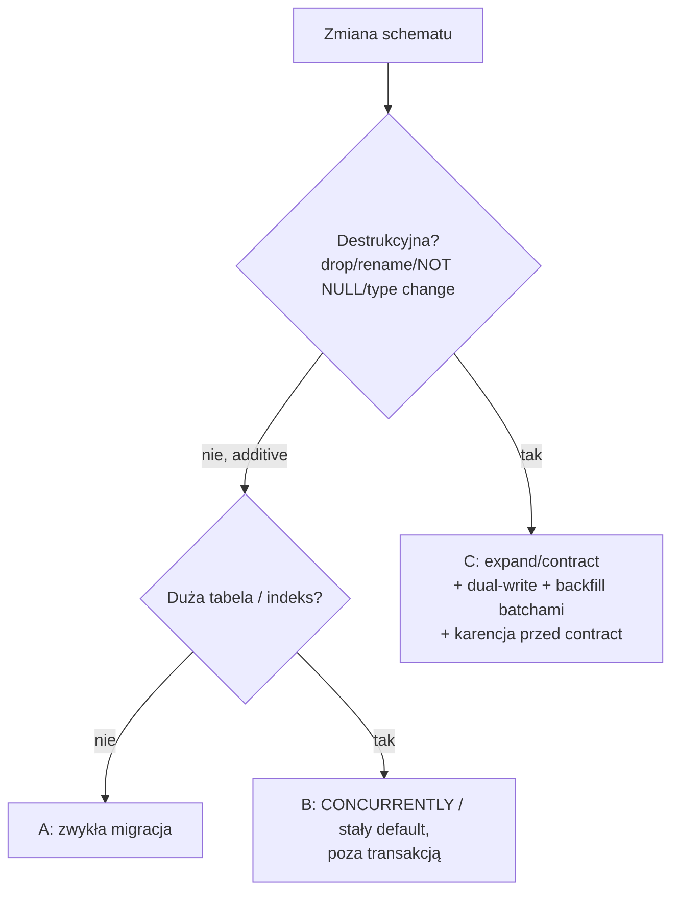
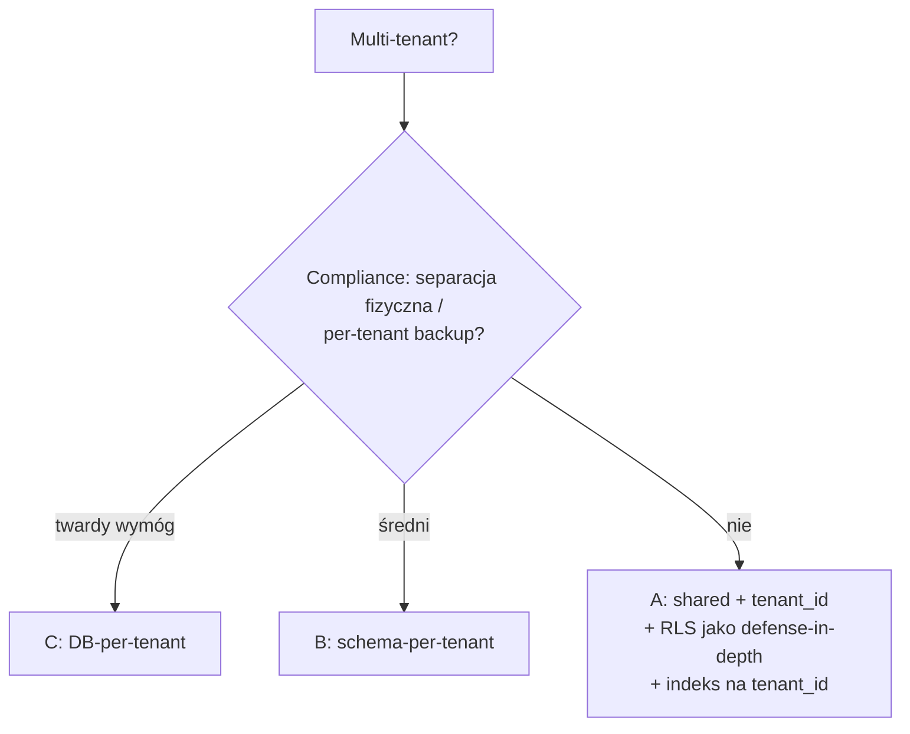
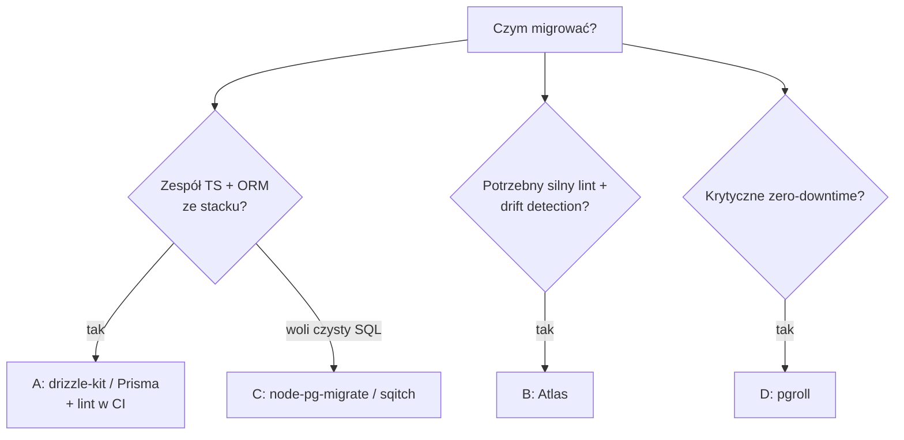
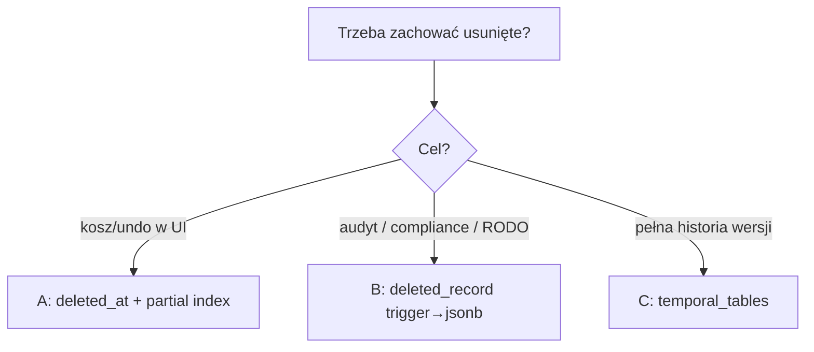

# Kompendium: PostgreSQL — projektowanie schematu + bezpieczne migracje

> Cel: baza wiedzy do nowego skilla `sailes-database` (projektowanie schematu + pisanie migracji dla B2B web-apps).
> Stack docelowy: **PostgreSQL**, ścieżka **ORM (Drizzle default / Prisma)** oraz **SQL-first**.
> Status źródeł: reguły zweryfikowane adwersaryjnie w 2 rundach deep-research (głosowania 3‑0 chyba że zaznaczono inaczej).
> - **Runda 1** (pełna): typy danych, bezpieczne migracje, narzędzia.
> - **Runda 2** (ubita przy ~80%, odzyskana z transkryptów): multi-tenancy/RLS, klucze (uuid/bigint/v7), soft-delete/temporal, audit, ADR/wizualizacja — **zweryfikowane**. Tematy **jsonb (§1.3)** i **enum/lookup (§1.4)** nie zdążyły wejść w fazę verify → oznaczone *UNVERIFIED (fetch-only)*: mocne źródła, ale bez głosowania.

---

## Jak czytać ten dokument — legenda decyzyjna

Każda sekcja jest oznaczona jednym z dwóch znaczników. To rozróżnienie jest **kluczowe**: mówi developerowi, gdzie ma realny wybór, a gdzie nie.

- **🔒 Twarda reguła** — brak sensownego wyboru. Złamanie = utrata danych, zablokowana produkcja albo cichy bug. Nie negocjujemy; stosujemy. (Typy danych §1.1, bezpieczeństwo migracji §2.) Wyjątki istnieją, ale są rzadkie i opisane wprost.
- **🔀 Decyzja zależna od potrzeb** — **ty wybierasz**. Pokazujemy opcje z ✅ zaletą i ⚠️ kosztem + rekomendację, ale finalna decyzja należy do developera w zależności od skali, compliance, zespołu i kontekstu. (Klucze §1.2, jsonb §1.3, enum/lookup §1.4, soft-delete §1.5, audit §1.6, indeksy §1.7, multi-tenancy §1.8, narzędzia §3.) Pełne karty decyzyjne → **§4**.

> Zasada Sailes: **AI rekomenduje (z wadami/zaletami), człowiek wybiera.** Dla 🔀 zawsze możesz wybrać inaczej niż rekomendacja — pod warunkiem, że rozumiesz koszt.

---

## 0. TL;DR — 🔒 twarde reguły (przyklej nad biurkiem)

**Typy danych (PostgreSQL official "Don't Do This" wiki — primary, 3‑0):**
- ✅ `timestamptz` zawsze dla momentu w czasie. ❌ nigdy `timestamp` (bez strefy).
- ✅ `bigint GENERATED ALWAYS AS IDENTITY` dla kluczy. ❌ nigdy `serial`/`bigserial`.
- ✅ `text` (+ `CHECK` na długość, jeśli naprawdę trzeba). ❌ nie domyślaj się `varchar(n)`, ❌ nigdy `char(n)`.
- ✅ `numeric` (lub `bigint` w groszach/centach) na pieniądze. ❌ nigdy typ `money`.

**Bezpieczne migracje (ankane/strong_migrations + GitLab style guide — primary, 3‑0):**
- ✅ Indeksy: `CREATE INDEX CONCURRENTLY`, **poza** transakcją DDL. ❌ zwykły `CREATE INDEX` blokuje zapisy (ACCESS EXCLUSIVE).
- ✅ `NOT NULL`: najpierw `CHECK (col IS NOT NULL) NOT VALID` → `VALIDATE` → `SET NOT NULL` → drop check. ❌ nigdy `SET NOT NULL` wprost na dużej tabeli.
- ✅ Nowa kolumna ze stałym defaultem — OK od PG11. ❌ nigdy kolumna z **volatile** defaultem (`gen_random_uuid()`, `clock_timestamp()`) — przepisuje całą tabelę.
- ✅ Backfill: w **batchach + throttling + poza** transakcją DDL. ❌ nigdy backfill w tej samej transakcji co `ALTER`.
- ✅ Wzorzec bazowy każdej ryzykownej zmiany: **expand/contract** (parallel change).
- 🎯 Zero-downtime to **wymóg**, nie preferencja (GitLab manduje to bezwzględnie).

---

## 1. Projektowanie schematu

### 1.1 🔒 Typy danych (zweryfikowane, 3‑0)
> 🔒 Twarda reguła. Wyjątki nazwane w kolumnie „Dlaczego" (np. `varchar(n)` OK dla sztywnych kodów). Poza tym: stosuj.

| Decyzja | Rób | Nie rób | Dlaczego |
|---|---|---|---|
| Czas | `timestamptz` | `timestamp` | `timestamptz` zapisuje moment (UTC); `timestamp` to „zdjęcie zegara" bez strefy → nie da się rzetelnie przeliczyć. Bare `timestamp` OK tylko dla czasów abstrakcyjnych bez arytmetyki. |
| Klucz auto-inc | `bigint GENERATED ALWAYS AS IDENTITY` | `serial`/`bigserial` | `serial` ma „dziwne" zachowania sekwencji/uprawnień; identity to standard SQL, `GENERATED ALWAYS` blokuje ręczny override → brak konfliktów wartości. `bigint` (nie `int`) by uniknąć przepełnienia. |
| Tekst | `text` (+`CHECK` na długość) | `char(n)`, domyślny `varchar(n)` | Trzy typy zajmują tyle samo miejsca; `char(n)` dopełnia spacjami (marnotrawstwo + narzut); limit `varchar(n)` wywala produkcję przy zmianie wymagań. `varchar(n)` OK dla sztywnych kodów. |
| Pieniądze | `numeric` lub `bigint` (grosze) | typ `money` | `money` nie obsługuje ułamków centa, nieprzewidywalnie zaokrągla, zakłada jedną walutę z `lc_monetary` (zmiana locale → „$10.00" pokazuje „10,00 Lei"). |

### 1.2 🔀 Klucze: uuid vs bigint vs UUIDv7 *(zweryfikowane, runda 2)* — karta → §4.1
- **`bigint GENERATED … AS IDENTITY`** — **default** dla kluczy wewnętrznych (Cybertec, 3‑0). Benchmark insert-only: bigint **107 090 ins/s vs uuid v4 74 947 ins/s**; indeks bigint rośnie 30,5 B/wiersz vs 41,7 B dla uuid. Reguła: *„use a sequence unless you use sharding"* + zawsze `bigint` (nie `integer` — przepełnienie + drogi `int→bigint` na dużej tabeli).
- **UUID v4 (losowy)** — ❗ unikaj jako PK (3‑0 + mocne corroboration): mit „losowość rozprasza zapisy/poprawia indeks" jest **fałszywy** (od PG11 wartości rosnące wypełniają indeks lepiej); 16 vs 8 B → większy indeks, gorsza lokalność cache. pganalyze: WAL **2 GB (bigserial) vs 40 GB (random uuid)**; fragmentacja liścia ~50% (v4) vs 0% (v7); 50M wierszy: **~20 min (v4) vs <2 min (v7)**.
- **UUID v7 (czasowo-uporządkowany, RFC 9562)** — nowoczesny kompromis: zalety UUID bez fragmentacji v4. **PostgreSQL 18 ma natywny `uuidv7()`** (+ `uuid_extract_timestamp()`), wcześniej rozszerzenie `pg_uuidv7`. Indeks v7 ~26% mniejszy od v4, fill liścia 90% vs 79% (v4).
- **Reguła ekspozycji:** nie pokazuj sekwencyjnego `bigint` w URL/API (zdradza liczebność, enumeracja). ❗ **UUIDv7 też zdradza czas utworzenia** (48‑bit ms timestamp) — jeśli to problem, trzymaj v7 wewnętrznie + osobny publiczny `gen_random_uuid()` (v4).

### 1.3 🔀 jsonb vs kolumny znormalizowane *(UNVERIFIED — fetch-only)* — karta → §4.2
- **jsonb dobrze:** rzadkie/zmienne/opcjonalne atrybuty, surowe payloady z zewnętrznych API, snapshoty audytowe, konfiguracje.
- **jsonb źle:** pola które filtrujesz/sortujesz/joinujesz/wymuszasz constraintami. Pułapki (z konkretami):
  - **Brak statystyk per-klucz** → planner używa sztywnego **0,1% selektywności** (`contsel`) → drastycznie złe estymacje. Heap: zapytanie **~300 ms → ~584 s (~2000×)** po przeniesieniu kolumn do jsonb. pganalyze: 200 wierszy estymowane jako 7,8 mln → seq scan.
  - Aktualizacja przepisuje całą wartość (write amplification); TOAST przy dużych wartościach; brak FK/constraintów wewnątrz jsonb; ~30% więcej miejsca (klucze powtarzane per wiersz — Heap: 79 MB znormalizowane vs 164 MB jsonb).
- **Indeksowanie (Crunchy Data):** GIN (`USING gin (data)`) działa dla **zawierania `@>` i istnienia klucza `?`,`?|`,`?&`** — ale **NIE** dla nawigacji ścieżką (`data->'x'->>'y'`) ani porównań po wyłuskanej wartości. Do filtrowania po skalarze → **indeks ekspresyjny (B-tree)** na `(data->>'pole')`, a cast w zapytaniu musi *dokładnie* pasować do castu w indeksie.
- **Fix estymacji (PG14+):** `CREATE STATISTICS … ON (data ->> 'pole') FROM tabela;` albo przepisz `@> '{"age":27}'` na `data->>'age' = '27'` + B-tree.
- **Reguła:** jeśli pole pojawia się w `WHERE`/`JOIN`/`ORDER BY` lub ma niezmiennik — to kolumna, nie klucz w jsonb. (`strong_migrations` flaguje dodanie kolumny `json` zamiast `jsonb` jako unsafe.)

### 1.4 🔀 enum vs lookup table vs CHECK *(częściowo UNVERIFIED)* — karta → §4.6
- **CHECK constraint** — Crunchy Data **rekomenduje CHECK przed enum**: łatwiej modyfikować/usuwać (bez alterowania typu), obsługuje logikę warunkową/wielokolumnową (`tracking_id NOT NULL tylko gdy status='shipped'`, `updated_at >= created_at`). Dobry dla małego stabilnego zbioru.
- **enum (typ)** — zwięzły, wartość inline bez joina; ale trudny do usunięcia/przestawienia wartości, brak metadanych. Dodanie wartości OK; usunięcie/reorder bolesne.
- **lookup table** — FK + joinowalne metadane (label, sort_order, active). Wybór gdy zbiór rośnie / potrzebuje atrybutów. Koszt: join.
- ⚠️ **Luka w researchu:** źródło dla strony „lookup table" (Cybertec) **nie pobrało się** — to najsłabiej udokumentowany temat; ta sekcja oparta na ogólnej wiedzy + Crunchy (strona enum vs CHECK).

### 1.5 🔀 Soft delete vs history/journal *(temporal: zweryfikowane 3‑0; reszta fetch-only)* — karta → §4.7
- **`deleted_at timestamptz`** — proste, ale (brandur, „soft deletion probably isn't worth it"): każde zapytanie musi filtrować `deleted_at IS NULL` (łatwo zapomnieć → wyciek/bug); **łamie integralność referencyjną** (FK nie chroni „usuniętego" klienta z żywymi fakturami); konflikty unikalności (rozwiązanie: partial unique index `WHERE deleted_at IS NULL`); **undelete w praktyce prawie nigdy nie jest używany** (10+ lat Heroku/Stripe); komplikuje RODO.
- **Wzorzec `deleted_record` (rekomendowany przez brandur)** — twardy DELETE + trigger `AFTER DELETE` zrzucający cały wiersz jako `to_jsonb(OLD.*)` do jednej tabeli (`id, deleted_at, original_table, original_id, data jsonb`). Brak `deleted_at IS NULL` w zapytaniach, brak problemów z FK.
- **System-versioning / temporal tables** (rozszerzenie `temporal_tables`, **zweryfikowane 3‑0**): trigger `versioning(<sys_period>, <history_table>, <adjust>)` BEFORE INS/UPD/DEL archiwizuje starą wersję wiersza do tabeli historii. Tylko system-period (nie application-period), PG9.2+, `tstzrange`.
- **Reguła:** soft delete dla „kosza/undo" w UI; `deleted_record`/journal/temporal dla audytu i compliance.

### 1.6 🔀 Kolumny audytowe i audit log *(supa_audit: zweryfikowane; reszta fetch-only)*
- Standard na każdej tabeli domenowej: `created_at timestamptz default now()`, `updated_at timestamptz`, opcjonalnie `created_by`/`updated_by`. (Te konwencje kolumn — fetch nie pokrył wprost; ogólna wiedza.)
- `updated_at`: trigger DB (pewny) lub warstwa app (prostszy, ale łatwo pominąć batch/SQL).
- **Audit log trigger-based** (`supa_audit`, zweryfikowane 3‑0 / 2‑1):
  - Centralna tabela `audit.record_version` z kolumnami `record jsonb` + `old_record jsonb` (❗ **`jsonb`, nie `json`** — korekta z głosowania 2‑1), loguje INSERT/UPDATE/DELETE/TRUNCATE; stabilne `record_id` (UUID z PK) do historii wiersza; BRIN na timestamp; filtruj po indeksowanym `table_oid`, nie `table_name`.
  - ❗ **Koszt:** maintainer odradza tracking na tabelach o szczycie zapisu **>3000 ops/s** (zweryfikowane 3‑0). (Repo archiwalne 2025‑02, v0.3.1.)
- **Alternatywa: pgAudit** — pisze do **logów Postgresa, nie do tabel**; bardziej niezawodne, ale ogromny wolumen logów + konfiguracja per-rola. Trigger = wygodne małej skali; pgAudit = solidne, ale config-heavy.

### 1.7 🔀 Indeksy (use-the-index-luke — primary)
- Domyślnie **B-tree**; **GIN** dla jsonb/full-text/tablic; **partial** (`WHERE ...`) dla soft-delete/flag; **composite** dla zapytań wielokolumnowych (kolejność kolumn = od najbardziej selektywnej / zgodnie z `WHERE`+`ORDER BY`).
- **Kiedy NIE indeksować:** małe tabele, kolumny rzadko w `WHERE`, kolumny o niskiej kardynalności bez partial, tabele write-heavy gdzie indeks spowalnia zapisy. Każdy indeks = koszt zapisu + miejsce.
- Zawsze indeks na `tenant_id` i na kolumnach FK.

### 1.8 🔀 Multi-tenancy *(RLS: zweryfikowane 3‑0, runda 2)* — karta → §4.4

| Model | Izolacja | Koszt migracji | Skala (liczba tenantów) | Kiedy |
|---|---|---|---|---|
| Shared schema + `tenant_id` | Najsłabsza (logiczna) | 1 migracja | Bardzo duża (tysiące) | Default dla B2B SaaS; jedyny „prawdziwie relacyjny" skalujący do tysięcy (PlanetScale) |
| Schema-per-tenant | Średnia | Fan-out × N schem | Średnia (≲ setki) | Klient wymaga separacji; tani offboarding (`DROP SCHEMA`) |
| DB-per-tenant | Najsilniejsza | Fan-out × N baz | Mała (enterprise) | Compliance / per-tenant backup-restore; ❗ szybko bije w limity poolingu (pula per-DB) |

> Offboarding: shared-schema = `DELETE` (dead tuples); schema/DB-per-tenant = `DROP` (tanio).

**Row-Level Security (RLS)** dla shared-schema (AWS RLS guide + Crunchy Data, zweryfikowane 3‑0):
- Włączane **per-tabela**: `ALTER TABLE x ENABLE ROW LEVEL SECURITY;` + `CREATE POLICY … USING (tenant_id = current_setting('app.current_tenant')::uuid)`.
- Bare `CREATE POLICY` = `FOR ALL` → `USING` działa też jako `WITH CHECK` dla zapisów (tylko dla ALL/UPDATE).
- **Wzorzec preferowany:** zmienna sesyjna ustawiana per-request przez app (`SET app.current_tenant = …`), **NIE** osobny rola/user per tenant (AWS: pierwsza opcja wymaga roli per tenant). Polityka celuje w rolę aplikacyjną (`TO application`), nie w ownera.
- ❗ **Footguny (zweryfikowane + fetch):**
  - **Owner omija RLS** domyślnie → ustaw `FORCE ROW LEVEL SECURITY` i **nie łącz się jako owner** tabeli.
  - **Superuser / rola z `BYPASSRLS`** omija RLS **po cichu** (brak błędu) — uwaga przy testach jako superuser (fałszywe poczucie bezpieczeństwa).
  - **Brak indeksu na `tenant_id`** → predykat polityki w każdym zapytaniu = wolno.
  - **Pooling:** zwykły `SET` przecieka między połączeniami w PgBouncer (transaction mode) → użyj `SET LOCAL` / `set_config(…, true)` w transakcji.
  - **Funkcje nie-`LEAKPROOF`** w zapytaniach na tabelach RLS → filtr RLS aplikowany *przed* funkcją → często full scan (ms → godziny).
- ❗ **Obalony mit (REFUTED 3‑0):** „RLS jest *wymagane* dla pooled shared-schema". **Nie jest.** Filtrowanie w warstwie app (`WHERE tenant_id = ?`, global scopes ORM) to pełnoprawna alternatywa (Citus/Microsoft, PlanetScale wręcz odradza RLS). Traktuj RLS jako *defense-in-depth / wybór projektowy*, nie obowiązek.

---

## 2. 🔒 Bezpieczne migracje
> 🔒 Twarda reguła w całości. To nie są preferencje stylu — łamanie tych reguł blokuje produkcję lub niszczy dane. „Jak migrować" (które narzędzie) jest 🔀 (§3); „czy migrować bezpiecznie" nie jest.

### 2.1 Expand/contract (parallel change) — kręgosłup (3‑0)
1. **Expand** — dodaj nowy kształt (kolumna/tabela), zgodny wstecz.
2. **Dual-write** — zapisuj do starego i nowego.
3. **Backfill** — przenieś dane (batchami, patrz 2.3).
4. **Read new** — przełącz odczyty na nowe.
5. **Write new only** — przestań pisać do starego.
6. **Contract** — usuń stare.

> ⚠️ Wzorzec gwarantuje **kompatybilność kodu**, nie bezpieczeństwo blokad. Duży `ALTER`/backfill nadal może wziąć ACCESS EXCLUSIVE / przepisać tabelę — dlatego reguły niżej są konieczne RAZEM z wzorcem.
> Referencje: PlanetScale (6 kroków), Stripe online-migrations (4‑fazowy dual-write), Martin Fowler ParallelChange, pgroll.

### 2.2 Katalog ryzykownych operacji (strong_migrations + Postgres docs, 3‑0)

| Operacja | Problem | Bezpiecznie |
|---|---|---|
| Dodanie indeksu | `CREATE INDEX` → ACCESS EXCLUSIVE, blokuje zapisy | `CREATE INDEX CONCURRENTLY`, poza transakcją (`disable_ddl_transaction!`) |
| `SET NOT NULL` | ACCESS EXCLUSIVE + skan całej tabeli (blokuje read+write) | `CHECK (col IS NOT NULL) NOT VALID` → `VALIDATE CONSTRAINT` (SHARE UPDATE EXCL) → `SET NOT NULL` (PG12+ pomija skan) → drop check |
| Kolumna z volatile default | Przepisuje całą tabelę, blokuje read+write | Dodaj kolumnę bez defaultu → ustaw default osobno → backfill batchami. (Stały default = OK od PG11) |
| Backfill | W tej samej transakcji co `ALTER` → tabela zablokowana na cały czas | Batching + throttling (sleep) + poza transakcją DDL |
| Rename/drop kolumny/tabeli | Złamanie kodu / blokada | Przez expand/contract; drop dopiero po pełnym przełączeniu i okresie karencji |

### 2.3 Backfill dużych tabel (3‑0)
Trzy klucze: **batching** (`in_batches(of: 10000)`), **throttling** (`sleep` między batchami), **poza transakcją**.
GitLab: migracje danych zawsze batchami; background-migrations **nie zmieniają schematu**.
> ❗ Obalone (0‑3): „backfill offline/distributed zamiast na żywej produkcji" — Stripe backfilluje **w fazie dual-write na żywej bazie**, nie offline.

### 2.4 Transakcyjność, lock_timeout, retry (postgres.ai — primary)
- DDL w Postgres jest transakcyjny — ale `CONCURRENTLY` i backfille muszą być POZA transakcją.
- Ustaw krótki `lock_timeout` + retry, żeby migracja czekająca na lock nie blokowała kolejki zapytań (lock queue).
- Idempotencja: `IF NOT EXISTS` / sprawdzenie stanu przed zmianą, żeby ponowienie było bezpieczne.

### 2.5 Reversibility, ordering, testowanie
- Każda migracja: zdefiniowany i przetestowany rollback (lub świadoma decyzja „forward-only" dla destrukcyjnych).
- Ordering: narzędzie śledzi zastosowane migracje (tabela rewizji). Uważaj na **drift** (patrz 3).
- Testuj migracje: na kopii schematu prod, integracyjnie (np. Testcontainers), z weryfikacją danych po (`SELECT`/count).

---

## 3. 🔀 Narzędzia (porównanie) — karta → §4.5

### 3.1 ORM-y (TS/Node)
- **Drizzle (drizzle-kit)** — schema-as-TS, generuje SQL migracje, blisko SQL, świetne do raportów/integracji/audytu i „czytelności dla agentów". **Default dla Waszego stacku** (per `stack-baseline.md`).
- **Prisma Migrate** — schema-as-DSL (`schema.prisma`), generuje migracje z diffu, dev-friendly; Prisma 7 bez Rust. Plan B.
- Wspólne: oba mają migracje wersjonowane (imperatywne pliki) + jakiś `db push` (declarative dla devu — nie na produkcję).

### 3.2 SQL-first / dedykowane
- **Atlas** — **deklaratywny/state-based** (jak Terraform: definiujesz docelowy stan w SQL/HCL/ORM, Atlas planuje diff), ale wspiera też wersjonowane migracje. **50+ analizatorów lintu** (wykrywa destrukcyjne zmiany, locki, BC-breaki: DS102/103, MF103/104, PG301), **drift detection** (pre-apply check: ostatnia rewizja → oczekiwany stan z rejestru → inspekcja DB → diff). ⚠️ „98% feature support" i „50+" to dane vendora (2‑1 / niezbenczowane); lint wyszedł z darmowego planu w X.2025 — **sprawdź aktualny licensing**.
- **Flyway / Liquibase** — **imperatywne** (sam piszesz i porządkujesz skrypty/changesety). Flyway: checks komercyjne (Teams skasowany V.2025). Liquibase: policy checks tylko Pro.
- **pgroll** (xata) — **automatyzuje expand/contract zero-downtime**: wirtualne schematy (views nad tabelami), stara i nowa wersja schematu dostępne równocześnie, backfill nowej kolumny + **dwukierunkowe triggery** propagujące zapisy stary↔nowy przez cały czas migracji. ⚠️ Obalone (1‑2): „pgroll stosuje WSZYSTKIE zmiany additive bez łamania schematu" — nie tak ogólnie.
- **node-pg-migrate / golang-migrate / sqitch** — lekkie, surowe migracje SQL, ręczny up/down.

### 3.3 Drift
Drift = baza docelowa rozjeżdża się z wersjonowanym źródłem prawdy. Groźny w workflow wersjonowanym (migracja planowana w dev/CI, wykonywana na deployu wobec ZAKŁADANEGO stanu) → może „fail mid-flight / partially apply / silently produce different result". Atlas wykrywa synchronicznym pre-apply checkiem.

---

## 4. 🔀 Karty decyzyjne (format Sailes: AI rekomenduje, człowiek wybiera)

> Format każdej karty: **Decyzja → Dlaczego ważne → Opcje (✅ zaleta / ⚠️ koszt) → Rekomendacja → Twój wybór**.
> Przy każdej karcie drzewo Mermaid jako szybki skrót. Karty pokrywają tylko decyzje 🔀 — dla 🔒 nie ma wyboru.

### 4.1 Typ klucza głównego
**Decyzja:** jakiego typu PK użyć dla nowej tabeli.
**Dlaczego ważne:** wpływa na rozmiar/fragmentację indeksu, WAL/IO, możliwość generowania ID poza bazą, oraz bezpieczeństwo ekspozycji ID na zewnątrz. Zmiana typu PK na żywej, dużej tabeli jest droga.
**Opcje:**
- **A) `bigint GENERATED ALWAYS AS IDENTITY`** — ✅ najmniejszy indeks, najszybsze inserty (107k vs 75k ins/s), lokalność cache, najtańszy WAL. ⚠️ ID sekwencyjne → zdradza liczebność i pozwala na enumerację, jeśli wyciekną do URL/API; nie da się generować poza bazą.
- **B) UUID v7 (PG18 natywny `uuidv7()`, wcześniej `pg_uuidv7`)** — ✅ globalnie unikalne + uporządkowane czasowo (brak fragmentacji v4), generowalne po stronie klienta, nie zdradza liczebności. ⚠️ 16 vs 8 B (większy indeks niż bigint); zdradza **czas utworzenia** (48‑bit timestamp); wymaga PG18 lub rozszerzenia.
- **C) UUID v4 (`gen_random_uuid()`)** — ✅ pełna losowość (nie zdradza ani liczebności, ani czasu), generowalne wszędzie. ⚠️ ~50% fragmentacji liścia, WAL 40 GB vs 2 GB, 50M wierszy ~20 min vs <2 min — **najgorszy jako PK**; sensowny tylko jako publiczny identyfikator obok bigint PK.
**Rekomendacja:** **A** dla kluczy czysto wewnętrznych. **B (UUIDv7)** gdy ID wychodzi na zewnątrz lub potrzebujesz generacji rozproszonej. Hybryda (A wewnętrznie + publiczny v4) gdy nie chcesz zdradzać nawet czasu utworzenia.
**Twój wybór?** (możesz wybrać inaczej niż rekomenduję)


### 4.2 jsonb czy znormalizowana kolumna?
**Decyzja:** czy nowe pole trzymać jako kolumnę, czy jako klucz w jsonb.
**Dlaczego ważne:** wpływa na jakość planów zapytań (jsonb nie ma statystyk per-klucz → katastrofalne estymacje), możliwość indeksowania/constraintów, rozmiar i write amplification. Źle dobrane → regresja nawet ~2000× (300 ms → 584 s).
**Opcje:**
- **A) Znormalizowana kolumna** — ✅ statystyki plannera, indeksy B-tree, FK/CHECK, mniejszy rozmiar. ⚠️ sztywny schemat, migracja przy każdym nowym polu.
- **B) jsonb** — ✅ elastyczność dla rzadkich/zmiennych atrybutów, surowych payloadów API, snapshotów; bez migracji na nowe pole. ⚠️ brak statystyk per-klucz (złe plany), brak FK/constraintów wewnątrz, write amplification, TOAST, ~30% więcej miejsca; GIN tylko dla `@>`/istnienia klucza, nie dla nawigacji ścieżką.
**Rekomendacja:** **A**, jeśli pole pojawia się w `WHERE`/`JOIN`/`ORDER BY` albo ma niezmiennik. **B** tylko dla danych rzadkich/zmiennych/nieprzeszukiwanych. Hybryda: jsonb na surowiec + wypromowane kolumny na to, co realnie filtrujesz (+ `CREATE STATISTICS` na PG14+ jeśli musisz filtrować po jsonb).
**Twój wybór?**


### 4.3 Strategia migracji *(to wejście do 🔒 §2 — wybór dotyczy ścieżki, nie bezpieczeństwa)*
**Decyzja:** jaką ścieżką przeprowadzić konkretną zmianę schematu.
**Dlaczego ważne:** dobór ścieżki decyduje o tym, czy migracja jest zero-downtime. To nie jest „czy być bezpiecznym" (to 🔒), tylko „która z bezpiecznych ścieżek pasuje do tej zmiany".
**Opcje:**
- **A) Zwykła migracja w transakcji** — ✅ prosta, atomowa, łatwy rollback. ⚠️ tylko dla małych/additive zmian; na dużej tabeli weźmie lock.
- **B) Operacja online (CONCURRENTLY / stały default, poza transakcją)** — ✅ bez blokady zapisów na dużej tabeli. ⚠️ poza transakcją → brak auto-rollback, trzeba obsłużyć błąd ręcznie.
- **C) Pełny expand/contract + dual-write + backfill batchami** — ✅ jedyna bezpieczna ścieżka dla zmian destrukcyjnych (drop/rename/type change/NOT NULL). ⚠️ wieloetapowa, rozłożona na kilka deployów, więcej kodu (dual-write).
**Rekomendacja:** dobierz po naturze zmiany — additive+małe → A; additive+duże/indeks → B; destrukcyjne → C. (Patrz drzewo.)
**Twój wybór?**


### 4.4 Model multi-tenancy
**Decyzja:** jak izolować dane wielu klientów (tenantów).
**Dlaczego ważne:** determinuje koszt migracji (×1 vs ×N), skalę (dziesiątki vs tysiące tenantów), siłę izolacji, koszt per-tenant backup/offboarding i limity poolingu. Trudna do zmiany później.
**Opcje:**
- **A) Shared schema + `tenant_id` (+ RLS opcjonalnie)** — ✅ 1 migracja dla wszystkich, skaluje do tysięcy tenantów, jedyny „prawdziwie relacyjny". ⚠️ najsłabsza izolacja (logiczna), offboarding = `DELETE` (dead tuples), wymaga dyscypliny filtrowania / RLS.
- **B) Schema-per-tenant** — ✅ średnia izolacja, tani offboarding (`DROP SCHEMA`). ⚠️ migracja ×N schem, nie skaluje powyżej ~setek tenantów.
- **C) DB-per-tenant** — ✅ najsilniejsza izolacja, per-tenant backup/restore. ⚠️ migracja ×N baz, szybko bije w limity poolingu (pula per-DB), tylko enterprise/mała liczba tenantów.
**Rekomendacja:** **A** jako default dla B2B SaaS; **+RLS** jako defense-in-depth (nie obowiązek — app-level filtrowanie jest pełnoprawne). **B/C** dopiero gdy compliance wymusza separację. ❗ Jeśli RLS: `FORCE ROW LEVEL SECURITY`, nie łącz się jako owner/superuser, indeks na `tenant_id`, `SET LOCAL` w poolingu.
**Twój wybór?**


### 4.5 Narzędzie migracji
**Decyzja:** czym generować i stosować migracje.
**Dlaczego ważne:** lock-in w workflow zespołu, jakość kontroli bezpieczeństwa (lint), wykrywanie driftu, dopasowanie do ORM-a ze stacku.
**Opcje:**
- **A) Migracje ORM (drizzle-kit / Prisma Migrate)** — ✅ jedno źródło prawdy ze schematem aplikacji, zero dodatkowego narzędzia, dobre dla zespołu TS. ⚠️ minimalny lint bezpieczeństwa, słabsze wykrywanie driftu.
- **B) Atlas (deklaratywny, schema-as-code)** — ✅ 50+ analizatorów bezpieczeństwa, drift detection, planowanie diffu jak Terraform. ⚠️ kolejne narzędzie w stacku; część funkcji/lint poza darmowym planem (sprawdź licensing).
- **C) SQL-first imperatywne (node-pg-migrate / golang-migrate / sqitch / Flyway)** — ✅ pełna kontrola nad SQL, brak magii, łatwe code-review. ⚠️ ręczne pisanie up/down i pilnowanie bezpieczeństwa (sam stosujesz §2).
- **D) pgroll** — ✅ automatyzuje zero-downtime expand/contract (views + triggery). ⚠️ wąsko wyspecjalizowane, nowe, nie pokrywa wszystkich zmian.
**Rekomendacja:** **A (drizzle-kit)** jako default dla Waszego stacku; dołóż **lint w stylu strong_migrations / Atlas** jako bramkę bezpieczeństwa w CI. **C** gdy zespół woli czysty SQL. **D** dla najtrudniejszych zero-downtime przypadków.
**Twój wybór?**


### 4.6 enum vs lookup table vs CHECK
**Decyzja:** jak ograniczyć kolumnę do zbioru dozwolonych wartości.
**Dlaczego ważne:** wpływa na łatwość dodawania/usuwania wartości, możliwość trzymania metadanych (label, kolejność, aktywność) i koszt zapytań (join czy nie).
**Opcje:**
- **A) CHECK constraint (`status IN (...)`)** — ✅ najprościej, łatwo modyfikować, obsługuje logikę warunkową/wielokolumnową. ⚠️ brak metadanych, zmiana zbioru = migracja.
- **B) enum (typ)** — ✅ zwięzły, wartość inline bez joina. ⚠️ trudny do usunięcia/przestawienia wartości, brak metadanych.
- **C) lookup table (+ FK)** — ✅ joinowalne metadane (label, sort_order, active), wartości zmienialne bez migracji typu. ⚠️ koszt joina, dodatkowa tabela.
**Rekomendacja:** **A (CHECK)** dla małego, stabilnego zbioru (Crunchy Data wprost rekomenduje CHECK przed enum). **C (lookup)** gdy zbiór rośnie lub potrzebuje metadanych. **B (enum)** rzadko — tylko gdy zależy ci na zwięzłości inline.
**Twój wybór?** *(uwaga: strona „lookup table" słabiej udokumentowana — patrz §1.4)*

### 4.7 Soft delete vs history/journal
**Decyzja:** jak obsłużyć „usuwanie" danych, które trzeba zachować/cofnąć.
**Dlaczego ważne:** soft delete obciąża KAŻDE zapytanie i łamie FK; zła decyzja rozlewa się na cały kod i komplikuje RODO.
**Opcje:**
- **A) `deleted_at` (soft delete)** — ✅ proste „kosz/undo" w UI, jeden flag. ⚠️ każde zapytanie musi filtrować (łatwo zapomnieć → wyciek), łamie integralność FK, konflikty unikalności (partial index), komplikuje RODO; undelete w praktyce prawie nieużywany.
- **B) `deleted_record` (twardy DELETE + trigger → jsonb)** — ✅ czyste tabele żywe, brak `deleted_at IS NULL`, brak problemów z FK, dane zachowane do odtworzenia. ⚠️ odtworzenie wiersza nietrywialne (deserializacja jsonb), trigger do utrzymania.
- **C) Temporal / system-versioning (`temporal_tables`)** — ✅ automatyczna pełna historia wersji wiersza. ⚠️ rozszerzenie, tylko system-period, narzut zapisu.
**Rekomendacja:** **A** tylko dla UI „kosz/undo". Dla audytu/compliance **B** (rekomendacja brandura) lub **C** gdy potrzebujesz pełnej historii zmian, nie tylko usunięć.
**Twój wybór?**


### 4.8 Jak wizualizować i utrwalać decyzje w procesie *(zweryfikowane 3‑0, runda 2)*
- **Mermaid w markdown** (jak wyżej) — JS-based, tekstowe definicje renderowane w GitHub/IDE; węzły decyzyjne = romb `{…}` + krawędzie `-->|Tak|`. Wersjonowalne w repo, docs w sync z kodem.
- **ADR (Architecture Decision Records)** — jedna decyzja = jeden plik markdown (kontekst / decyzja / konsekwencje). Idealne dla „dlaczego UUIDv7", „dlaczego shared-schema". Standardy:
  - **Nygard** (oryginał 2011) — 5 sekcji: title, status, context, decision, consequences.
  - **MADR** (Markdown ADR) — wersjonowany standard (v4.0.0, 2024‑09), warianty full/minimal/bare, jawnie ujmuje rozważane opcje z pros/cons + metadane (deciders, status). Pliki `docs/decisions/nnnn-title.md`.
  - **`adr-tools`** — CLI do logu ADR jako pliki markdown (domyślnie `doc/adr`), auto-numeracja, superseding (`adr new -s`).
- **Tabele decyzyjne / checklisty** w stylu `strong_migrations` (operacja → ryzyko → fix) — blokuje niebezpieczne operacje domyślnie, podpowiada bezpieczny wariant; Postgres/MySQL/MariaDB. Patrz §2.2.

---

## 5. Źródła kanoniczne (do zaadoptowania)

**Reguły / repo (primary):**
- PostgreSQL "Don't Do This" — https://wiki.postgresql.org/wiki/Don't_Do_This
- Schema recommendations — https://wiki.postgresql.org/wiki/Database_Schema_Recommendations_for_an_Application
- ankane/strong_migrations — https://github.com/ankane/strong_migrations
- GitLab Migration Style Guide — https://docs.gitlab.com/development/migration_style_guide/
- xataio/pgroll — https://github.com/xataio/pgroll
- ariga/atlas — https://github.com/ariga/atlas · https://atlasgo.io/atlas-vs-others · https://atlasgo.io/versioned/drift-detection

**Inżynierskie posty (primary):**
- PlanetScale — safe schema changes — https://planetscale.com/blog/safely-making-database-schema-changes
- Stripe — online migrations — https://stripe.com/blog/online-migrations
- postgres.ai — zero-downtime, lock_timeout + retries — https://postgres.ai/blog/20210923-zero-downtime-postgres-schema-migrations-lock-timeout-and-retries
- use-the-index-luke — https://use-the-index-luke.com/
- Martin Fowler — Parallel Change — https://martinfowler.com/bliki/ParallelChange.html

**Multi-tenancy / RLS (zweryfikowane runda 2):**
- AWS — multi-tenant RLS (blog + prescriptive guidance) — https://aws.amazon.com/blogs/database/multi-tenant-data-isolation-with-postgresql-row-level-security/ · https://docs.aws.amazon.com/prescriptive-guidance/latest/saas-multitenant-managed-postgresql/rls.html
- Crunchy Data — RLS for tenants — https://www.crunchydata.com/blog/row-level-security-for-tenants-in-postgres
- Postgres docs — RLS — https://www.postgresql.org/docs/current/ddl-rowsecurity.html
- Bytebase — RLS footguns — https://www.bytebase.com/blog/postgres-row-level-security-footguns/
- PlanetScale — approaches to tenancy / „RLS sounds great until it isn't" — https://planetscale.com/blog/approaches-to-tenancy-in-postgres · https://planetscale.com/blog/rls-sounds-great-until-it-isnt
- Citus/Microsoft — multi-tenant — https://docs.citusdata.com/en/stable/use_cases/multi_tenant.html

**Klucze (zweryfikowane runda 2):**
- Cybertec — uuid/serial/identity — https://www.cybertec-postgresql.com/en/uuid-serial-or-identity-columns-for-postgresql-auto-generated-primary-keys/
- pganalyze — uuid vs serial — https://pganalyze.com/blog/5mins-postgres-uuid-vs-serial-primary-keys
- Andy Atkinson — avoid UUIDv4 PKs — https://andyatkinson.com/avoid-uuid-version-4-primary-keys
- PG18 UUIDv7 (benchmark) — https://nerdleveltech.com/postgres-18-uuidv7-primary-keys
- thebuild (C. Pettus) — https://thebuild.com/blog/2023/02/16/uuids-vs-serials-for-keys/ · Supabase — https://supabase.com/blog/choosing-a-postgres-primary-key

**jsonb / enum (UNVERIFIED — fetch-only):**
- Crunchy — indexing jsonb — https://www.crunchydata.com/blog/indexing-jsonb-in-postgres
- Heap — when to avoid jsonb — https://www.heap.io/blog/when-to-avoid-jsonb-in-a-postgresql-schema
- pganalyze — planner jsonb selectivity — https://pganalyze.com/blog/5mins-postgres-planner-jsonb-selectivity
- Crunchy — enums vs CHECK — https://www.crunchydata.com/blog/enums-vs-check-constraints-in-postgres

**Soft-delete / audit / ADR (zweryfikowane runda 2):**
- brandur — soft deletion / deleted_record — https://brandur.org/soft-deletion · https://brandur.org/fragments/deleted-record-insert
- temporal_tables — https://pgxn.org/dist/temporal_tables/ · https://github.com/arkhipov/temporal_tables
- supa_audit — https://github.com/supabase/supa_audit · pganalyze pgaudit vs supa_audit — https://pganalyze.com/blog/5mins-postgres-auditing-pgaudit-supabase-supa-audit
- Mermaid — https://github.com/mermaid-js/mermaid · MADR — https://github.com/adr/madr · adr-tools — https://github.com/npryce/adr-tools

---

## 6. Zaczepy do pipeline'u Sailes (z audytu repo)

Nowy skill **`sailes-database`** siada **po zatwierdzeniu speca, przed `sailes-implement`**, równolegle z `sailes-pre-implement`:

```
discovery → bootstrap → spec ──(approved)──→ pre-implement (BC + ryzyka)
                                             sailes-database (schema + migracje)  ← NOWY
                                                          ↓
                                             implement (build)
```

Granica DRY: **spec opisuje *co*** (sekcja Data Model: tabele/kolumny — `sailes-spec/SKILL.md:82-83`), **`sailes-database` implementuje *jak*** (kod migracji + checki + rollback).

Istniejące zaczepy do uzupełnienia, nie dublowania:
- `stack-baseline.md` — Postgres + Drizzle default / Prisma; „migracje commitowane + reviewed"; tabele cross-cutting (`users, sessions, audit_logs, webhook_events, integration_accounts, sync_runs, idempotency_keys, feature_flags`).
- `security-checklist.md:21` — twarda bramka „migrations reviewed (no unreviewed prod schema changes)".
- `sailes-pre-implement/SKILL.md:36` — wykrywa BC-break (rename/drop kolumny → migracja + backfill?).
- `modules-catalog.md:35-36` — tabele integracyjne CRM (`integration_accounts, external_object_links, webhook_events, sync_runs, idempotency_keys`).

Format decyzji: **decision card** Sailes (Decyzja / Dlaczego ważne / Opcje A‑B‑C z ✅⚠️ / Rekomendacja / Twój wybór) — „AI rekomenduje, człowiek wybiera" — zastosowany do §4.

Bramki agentic-first dla migracji:
- **Pre-write:** data model w specu zatwierdzony + przejrzany pod BC (bramka `sailes-pre-implement`).
- **Post-write:** migracja przechodzi safety-checklist (§2.2) + testy integracyjne + adwersaryjny review (`checker`) + dowód działania (`qa`).
- **Prod:** „never run production migrations without approval" (agentic-first-principles).

---

## 7. Proponowana struktura skilla (do akceptacji)

```
sailes-database/
├── SKILL.md                     # entry point (~140 linii, house style)
├── data-type-rules.md           # §1.1–1.6 reguły typów + klucze + jsonb + enum + soft-delete + audit
├── migration-safety-checklist.md# §2.2 katalog ryzyk + bramki (DRY-link z security-checklist)
├── decision-cards.md            # §4 drzewa decyzyjne w formacie decision card Sailes
├── multi-tenant-schema.md       # §1.8 modele + RLS + footguny
├── migration-drizzle-scaffold.md# wzorzec migracji Drizzle (expand/contract)
└── migration-prisma-scaffold.md # wzorzec migracji Prisma
```
```
